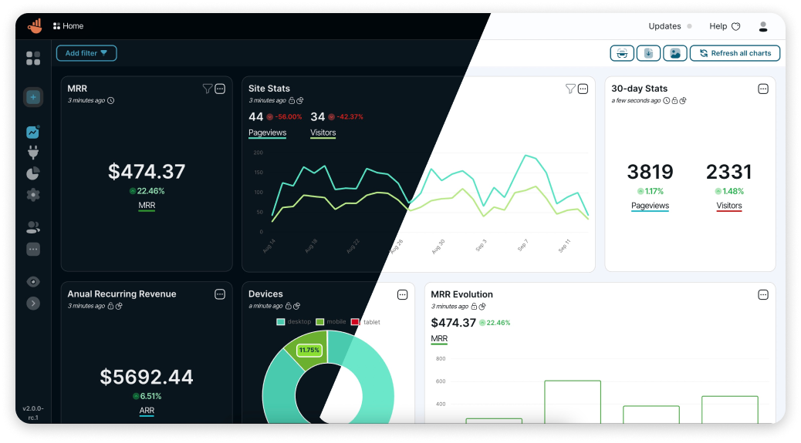

# Chartbrew CI/CD pipeline

Deploy Chartbrew server with CI/CD on Elestio

 
 

# Once deployed ...

You can can open Chartbrew UI here:

    URL: https://[CI_CD_DOMAIN]
    email:[ADMIN_EMAIL]
    password: [ADMIN_PASSWORD]

You can open PHPMyAdmin here:

    URL: https://[CI_CD_DOMAIN]:61528
    username: chartbrew
    password: [ADMIN_PASSWORD]
